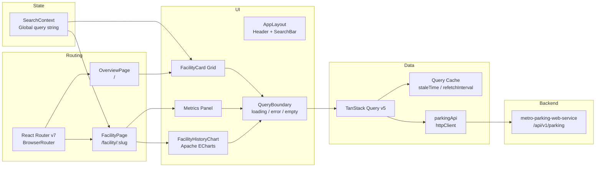

# Metro Parking App


A real-time parking availability dashboard for the Transport for NSW network. Displays live occupancy across all Park&Ride facilities with per-facility historical charts, transit line badges, and a global search experience.

> **Backend:** [metro-parking-web-service](https://github.com/Ethan-Singh/metro-parking-web-service) — Spring Boot service that ingests and serves the parking data this app consumes.

---

## Architecture



---

## Pages

### Overview — `/`

Displays all Park&Ride facilities as a responsive card grid. Each card shows the facility name, transit line badges, live occupancy with a colour-coded progress bar, available spot count, and last-updated time. A global search bar filters cards in real time by name or slug.

### Facility — `/facility/:slug`

Drills into a single facility. Shows three live metrics (occupancy %, available spots, total capacity) and an interactive 7-day occupancy chart. Above the chart, derived summary chips surface the most useful commuter signals: spots available at 7 am and 8 am, and the time the facility crossed 50%, 75%, and 90% occupancy.

---

## Data Fetching

All server state is managed by TanStack Query with two distinct cache profiles:

| Profile  | Used for                         | `staleTime` | `refetchInterval` |
| -------- | -------------------------------- | ----------- | ----------------- |
| `live`   | Overview list, facility overview | 30 s        | 30 s              |
| `static` | 7-day history chart              | 24 h        | —                 |

Live queries refetch on window focus and retry once on failure. History is treated as immutable for the session — yesterday's data does not change — so it is fetched once and cached indefinitely (`gcTime: Infinity`).

Query keys follow a structured factory pattern (`parkingKeys.list()`, `parkingKeys.overview(slug)`, `parkingKeys.history(slug, from, to)`) for cache invalidation safety.

---

## Component Design

### `QueryBoundary`

A single wrapper component that handles all three non-content states — loading, error, and empty — with slot overrides for custom skeletons. Every data-dependent subtree is wrapped in one, keeping page components free of conditional rendering boilerplate.

### `FacilityHistoryChart`

Built on Apache ECharts via `echarts-for-react`. Features:

- Area line series with a dashed 100% capacity mark line
- Warning band shaded between 85–100% occupancy
- Inside `dataZoom` for touch/scroll zooming
- Tooltip formatted to `en-AU` locale (`Wed, 08:30 AM · 74.2%`)
- Y-axis auto-scaled with 5-unit padding above and below the data range

### `LineBadge`

Renders circular Transit for NSW line indicators (M, T, T1–T9, B, B1, BMT, CCN) from a static slug → lines config. Colours match the official TfNSW palette. Each badge renders as a bordered circle with a drop shadow, consistent with TfNSW wayfinding design.

### `SearchBar`

Context-driven search with a Popper dropdown that activates only on the facility detail page (so search on the overview filters cards in-place rather than opening a dropdown). Results are capped at 3 and navigate directly to the facility on selection.

---

## History Summary

`buildHistorySummary` processes raw `DataPoint[]` into commuter-relevant signals without a library:

- **7 am / 8 am availability** — finds the closest snapshot to each target time per day across the window, takes the most recent day
- **Threshold crossing times** — first timestamp where occupancy rate crossed 50%, 75%, and 90%
- **Peak occupancy** — highest rate observed and its timestamp
- **Lowest available** — minimum available spots across the window

---

## Token System

All colours, spacing, shadows, and motion values are defined once in `tokens.ts` and consumed by both the MUI theme and component-level `sx` props. The theme is a thin wrapper over the token set — no values are hardcoded in components.

```
tokens.color.primary     #0A4FA6
tokens.color.secondary   #0097B8  (chart line)
tokens.color.success     #007D66  (available)
tokens.color.warning     #92610A  (almost full)
tokens.color.error       #9B1C1C  (full)
```

The body renders a fixed three-stop blue gradient (`#C8E8F8 → #DCF0FA → #EAF5FC`) to evoke the TfNSW colour language. Cards use a frosted glass surface (`rgba(255,255,255,0.80)`) with a lift-on-hover shadow transition.

---

## Testing

### Unit / Component Tests (Vitest + Testing Library)

```bash
npm run test        # watch mode
npm run test:run    # single run
```

## End-to-End Tests (Playwright)

Tests run against Chromium, Firefox, and WebKit. The dev server starts automatically before the suite.

```bash
npm run test:e2e
```

All suites use `page.route(...)` to intercept API calls and fulfill with mocked JSON — no backend required. CI runs with 1 worker and 2 retries; local runs are fully parallel.

### `OverviewPage`

- Heading and facility count text render
- Card grid renders the correct number of facilities from mocked list response
- Clicking a card navigates to `/facility/:slug`

### `FacilityPage`

- Facility name, occupancy %, available spots, and total capacity render correctly from mocked overview response
- Apache ECharts canvas is visible
- Back button navigates to `/`

---

## Running Locally

```bash
npm install
npm run dev        # http://localhost:5173
```

The app proxies `/api/**` to the backend. Ensure the [metro-parking-web-service](../metro-parking-web-service) is running, or point `VITE_API_BASE` at a deployed instance.

```bash
npm run build      # production build
npm run check      # ESLint + Prettier
npm run format     # auto-format
```
